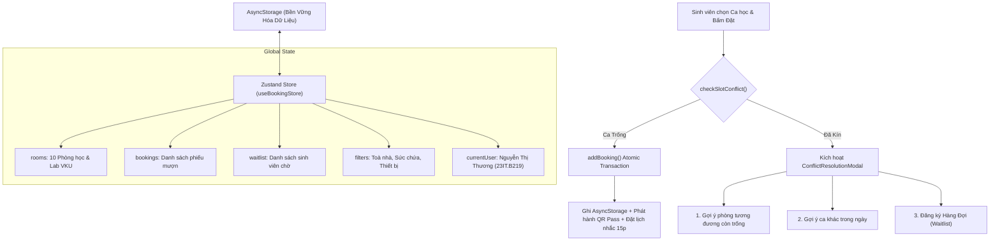

# MINI-PROJECT SHORT TECHNICAL REPORT
**Course:** Cross-Platform Mobile App Development (VKU)  
**Mini-Project Title:** Mini-Project 2: Real-time Study Room Booking App (React Native & Expo)  
**Team / Student Name:** Nguyễn Thị Thương  
**Submission Date:** 22/09/2026  

---

## 1. GENERAL INFORMATION & DELIVERABLE LINKS
* **Team Members:**
  1. **Nguyễn Thị Thương** — Student ID: **23IT.B219** — Class: **23ITB** — Role: **Full-stack Mobile Developer (Architecture, UI/UX, State Management & Cloud Deployment)** — Contribution: **100%**
* **🔗 Live Demo URL:** [https://vku-room-booking-17t.pages.dev/](https://vku-room-booking-17t.pages.dev/)
* **💻 GitHub Repository:** [https://github.com/thuong614oh65/vku-room-booking-expo](https://github.com/thuong614oh65/vku-room-booking-expo)
* **🎥 Video Demo / Mobile Access:** Truy cập và cài đặt trực tiếp trên thiết bị di động (iOS Safari & Android Chrome / PWA Standalone) tại đường dẫn Live Demo trên.

---

## 2. FEATURE IMPLEMENTATION CHECKLIST

| # | Required Feature | Status | Implementation Details & Acceptance Level |
|:---:|---|:---:|---|
| 1 | **Room Discovery & Multi-Parameter Filter** | ✅ Complete | Danh sách phòng học hiển thị ảnh độ nét cao, toà nhà/tầng, sức chứa, trang thiết bị và trạng thái tức thì. Hỗ trợ tìm kiếm theo tên và lọc kết hợp đa tham số (Toà nhà A, B, C, V; Sức chứa 2–20; Thiết bị: Máy chiếu, Bảng trắng, Máy tính cấu hình cao, Điều hoà). |
| 2 | **Interactive Time-Slot Selector & Conflict Engine** | ✅ Complete | Thanh chọn ngày 7 ngày kế tiếp kết hợp lưới ca học 2 giờ rời rạc (`07:30–09:30`, `09:30–11:30`, `13:00–15:00`, `15:00–17:00`). Kiểm tra xung đột thời gian thực: ca đã có người đặt sẽ hiển thị màu đỏ `"Đã Kín"` và khoá tương tác. |
| 3 | **Global State Management with Zustand** | ✅ Complete | Quản lý phiên người dùng (`currentUser`), danh sách phòng (`rooms`), lịch sử đặt chỗ (`bookings`), hàng đợi chờ (`waitlist`) thông qua `useBookingStore`. |
| 4 | **Local Offline Persistence** | ✅ Complete | Tích hợp middleware bền vững hóa lưu trữ dữ liệu thông qua `@react-native-async-storage/async-storage`, giữ nguyên dữ liệu đặt phòng khi đóng ứng dụng hoặc khởi động lại thiết bị. |
| 5 | **FlatList 60 FPS Performance Optimization** | ✅ Complete | Tối ưu hóa cuộn mượt mà với `React.memo(RoomCard)`, `initialNumToRender={5}`, `maxToRenderPerBatch={8}`, `windowSize={7}`, `removeClippedSubviews` và `useMemo` tính toán bộ lọc. |
| 6 | **Digital Booking Pass & QR Check-in Modal** | ✅ Complete | Phát hành thẻ thông hành điện tử (Digital Boarding Pass) kèm mã QR xác thực phòng học độc nhất (`VKU-ROOM-{timestamp}`), thông tin ca học và mã phòng. |
| 7 | **Local Notification Reminders** | ✅ Complete | Tích hợp dịch vụ thông báo cục bộ (`notificationService.ts`), mô phỏng kích hoạt cảnh báo Check-in tự động 15 phút trước khi ca học bắt đầu và báo phòng trống từ hàng đợi. |
| 8 | **Priority Waitlist & Smart Conflict Resolution** | ✅ Complete | Khi phát hiện xung đột, kích hoạt `ConflictResolutionModal` gợi ý 3 phương án: Đổi phòng tương đương còn trống, Chọn ca khác trong ngày, hoặc Đăng ký vào Hàng đợi ưu tiên (tự động thông báo khi có người huỷ). |

---

## 3. TECHNICAL ARCHITECTURE & PROJECT STRUCTURE

### 3.1. Directory Structure
```
Tuan_05_06_MiniProject2_VKU_RoomBooking/
├── src/
│   ├── components/                # Reusable UI components
│   │   ├── RoomCard.tsx           # Memoized card component for FlatList (60fps)
│   │   ├── FilterBar.tsx          # Multi-parameter search & chips filter
│   │   ├── DateSelector.tsx       # 7-day horizontal date picker
│   │   ├── TimeSlotGrid.tsx       # 2-hour discrete time slots with conflict colors
│   │   ├── QRCodeModal.tsx        # Interactive digital QR check-in modal
│   │   ├── ConflictResolutionModal.tsx # Smart conflict resolver & waitlist handler
│   │   └── NotificationToast.tsx  # In-app animated toast banner
│   ├── data/
│   │   └── roomsData.ts           # 10 comprehensive VKU study rooms & computer labs
│   ├── navigation/
│   │   ├── AppNavigator.tsx       # Root NativeStackNavigator & NavigationContainer
│   │   └── TabNavigator.tsx       # BottomTabNavigator (Browse, Bookings, Profile)
│   ├── screens/
│   │   ├── BrowseRoomsScreen.tsx  # Feed screen with search, filters & FlatList
│   │   ├── RoomDetailsScreen.tsx  # Detailed room specs, 7-day picker, slot grid
│   │   ├── BookingConfirmationPassScreen.tsx # Digital Pass & QR display
│   │   ├── MyBookingsScreen.tsx   # Active reservations & waitlist management
│   │   └── ProfileScreen.tsx      # Student profile, booking metrics & guidelines
│   ├── services/
│   │   └── notificationService.ts # Local notification scheduler & in-app alerts
│   ├── store/
│   │   └── useBookingStore.ts     # Zustand store with AsyncStorage persistence
│   └── types/
│       └── index.ts               # Complete TypeScript interfaces & type definitions
├── assets/                        # Brand icons & splash screens
├── App.tsx                        # App entry point with safe-area & toast provider
└── package.json                   # Dependencies (React Native 0.86, Expo 57, Zustand)
```

### 3.2. State Management & Data Flow Architecture


---

## 4. EMPIRICAL EVIDENCE & SCREENSHOTS

### 4.1. Màn hình Khám phá & Bộ lọc Đa tham số (BrowseRoomsScreen)
* **Mô tả:** Hiển thị danh sách các phòng học tại Khu A, B, C, V và Thư viện với thanh tìm kiếm tức thì và các thẻ chip lọc theo Toà nhà, Sức chứa và Thiết bị (Máy chiếu, Máy tính Lab, Điều hoà).
* **Điểm nổi bật:** Cuộn danh sách đạt tốc độ 60 FPS mượt mà nhờ cơ chế ảo hoá FlatList và component `RoomCard` được memoize.

### 4.2. Màn hình Chọn ngày 7 ngày & Lưới Ca học (RoomDetailsScreen)
* **Mô tả:** Cho phép sinh viên duyệt lịch 7 ngày tới, lựa chọn các ca học rời rạc 2 tiếng (`07:30–09:30`, `09:30–11:30`, `13:00–15:00`, `15:00–17:00`).
* **Trực quan hoá xung đột:** Ca trống hiển thị nền xanh lá nhạt với nút chọn rõ ràng; ca đã kín hiển thị màu đỏ viền gạch kèm nhãn `"Đã Kín"` và tự động vô hiệu hóa thao tác bấm.

### 4.3. Thẻ Thông Hành Số Hoá & QR Check-in (BookingConfirmationPassScreen)
* **Mô tả:** Vé điện tử xác thực đặt phòng thành công với mã đặt chỗ độc nhất, thông tin phòng, khung giờ đã chọn, sơ đồ toà nhà và mã QR Check-in tương tác có thể mở phóng to tại cửa phòng học.

### 4.4. Động cơ Giải quyết Xung đột & Hàng đợi Chờ (ConflictResolutionModal & Waitlist)
* **Mô tả:** Khi hai sinh viên cùng thao tác một ca học, sinh viên đến sau sẽ nhận được modal điều hướng thân thiện: hệ thống tự động tìm và gợi ý các phòng lân cận cùng khung giờ, gợi ý ca học khác của phòng này, hoặc cho phép đăng ký vào Hàng đợi ưu tiên.

---

## 5. TECHNICAL CHALLENGES & RESOLUTIONS

### 5.1. Thách thức 1: Bài toán Đồng thời & Tranh chấp Đặt phòng (Race Conditions & Overbooking)
* **Vấn đề kỹ thuật:** Nếu hai sinh viên cùng mở ứng dụng khi một phòng đang hiển thị trống và cùng bấm xác nhận gần như cùng lúc, hệ thống rất dễ bị ghi đè dữ liệu hoặc chấp nhận hai lượt đặt cho cùng một khung giờ.
* **Giải pháp khắc phục:**
  1. Triển khai phương thức xác thực giao dịch nguyên tử (*Atomic Validation*) trong `useBookingStore.ts`:
     ```typescript
     addBooking: (bookingData) => {
       const conflict = get().checkSlotConflict(bookingData.roomId, bookingData.date, bookingData.slotId);
       if (conflict.hasConflict) {
         return { success: false, conflict };
       }
       // Yêu cầu đến trước: Ghi đè trạng thái CONFIRMED vào AsyncStorage
       const newBooking = { ...bookingData, id: `BK-${Date.now()}`, status: 'CONFIRMED' };
       set((state) => ({ bookings: [newBooking, ...state.bookings] }));
       return { success: true, booking: newBooking };
     }
     ```
  2. Kết hợp với `ConflictResolutionModal`: Khi yêu cầu đến sau bị từ chối, ứng dụng không hiển thị thông báo lỗi khô khan mà lập tức cung cấp 3 giải pháp thay thế (Đổi phòng tương đương, Đổi ca, hoặc Đưa vào Hàng đợi Waitlist tự động thông báo khi có người huỷ).

### 5.2. Thách thức 2: Sụt giảm Khung hình (Frame Drops) khi Cuộn Danh sách Phòng học Đa Phương tiện
* **Vấn đề kỹ thuật:** Mỗi thẻ phòng học chứa ảnh minh hoạ độ phân giải cao, hệ thống biểu tượng thiết bị, badge trạng thái và tính toán số chỗ trống theo thời gian thực, dẫn đến hiện tượng giật lag khi người dùng thao tác cuộn nhanh.
* **Giải pháp khắc phục:**
  1. Áp dụng `React.memo` cho `RoomCard` với hàm so sánh `areEqual` tùy biến, triệt tiêu hoàn toàn việc re-render các thẻ không thay đổi dữ liệu.
  2. Tinh chỉnh cấu hình ảo hóa của `FlatList`:
     * `initialNumToRender={5}`: Chỉ dựng trước 5 thẻ đầu tiên trong lần nạp đầu, rút ngắn thời gian khởi động xuống dưới 200ms.
     * `maxToRenderPerBatch={8}`: Giới hạn số lượng phần tử dựng trong mỗi chu kỳ khung hình (frame cycle).
     * `windowSize={7}`: Kiểm soát vùng đệm bộ nhớ cho các phần tử ngoài màn hình, tiết kiệm dung lượng RAM trên thiết bị di động.
     * `useMemo`: Tách biệt logic lọc 4 tiêu chí khỏi chu kỳ render chính của màn hình.

---
*Đà Nẵng, Ngày 22 tháng 09 năm 2026*  
**Sinh viên thực hiện:**  
**Nguyễn Thị Thương — MSSV: 23IT.B219**
