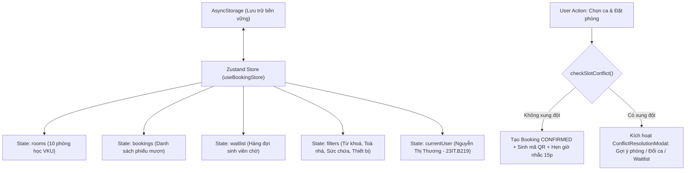

# BÁO CÁO KỸ THUẬT TIỂU LUẬN / MINI-PROJECT #2
## HỌC PHẦN: LẬP TRÌNH ĐA NỀN TẢNG (CROSS-PLATFORM DEVELOPMENT)
**TRƯỜNG ĐẠI HỌC CÔNG NGHỆ THÔNG TIN VÀ TRUYỀN THÔNG VIỆT - HÀN (VKU)**

---

### 📋 THÔNG TIN SINH VIÊN & ĐỀ TÀI
* **Họ và tên:** Nguyễn Thị Thương
* **Mã số sinh viên:** 23IT.B219
* **Lớp sinh hoạt:** 23ITB
* **Email sinh viên:** thuongnt.23itb@vku.udn.vn
* **Giảng viên hướng dẫn:** TS. Nguyễn Thanh Tuấn
* **Tên đề tài Mini-Project #2:** *Xây dựng ứng dụng đặt phòng học thời gian thực cho sinh viên VKU (Real-time Study Room Booking App - React Native & Expo)*
* **Thời gian thực hiện:** Tuần 5 – Tuần 6 • **Trọng số điểm:** 10%

---

## 1. TỔNG QUAN HỆ THỐNG & MỤC TIÊU KỸ THUẬT (EXECUTIVE SUMMARY)

Mini-Project #2 tập trung xây dựng giải pháp ứng dụng di động đa nền tảng tối ưu hóa quy trình tra cứu và mượn không gian học tập tại VKU (bao gồm phòng học nhóm, phòng máy tính Lab, hội trường nghiên cứu tại Khu A, B, C, V và Thư viện).

### 🎯 Các mục tiêu kỹ thuật cốt lõi:
1. **Kiến trúc phân cấp điều hướng:** Kết hợp chặt chẽ giữa `NativeStackNavigator` và `BottomTabNavigator` (`BrowseRooms`, `MyBookings`, `Profile`).
2. **Quản lý trạng thái phân tán bằng Zustand:** Tinh giản tối đa so với Redux, kết hợp lưu trữ bền vững `AsyncStorage` (`persist middleware`).
3. **Tối ưu hóa hiệu năng 60 FPS:** Khắc phục triệt để hiện tượng sụt giảm khung hình khi cuộn danh sách phòng học thông qua `FlatList`, `React.memo`, `windowSize`, và cấu trúc bố cục tĩnh.
4. **Động cơ giải quyết xung đột thời gian thực (Real-time Conflict Resolution Engine):** Xử lý triệt để bài toán đồng thời (concurrency) khi nhiều sinh viên cùng tranh chấp một phòng học trong một ca.
5. **Thông báo đẩy & Nhắc nhở thông minh:** Tự động kích hoạt thông báo 15 phút trước giờ nhận phòng và báo phòng trống từ hàng đợi (Waitlist).
6. **Thẻ thông hành số hóa (Digital QR Pass):** Tự động phát hành vé điện tử kèm mã QR phục vụ quét xác thực Check-in tức thì tại cửa phòng học.

---

## 2. KIẾN TRÚC HỆ THỐNG & QUẢN TRỊ TRẠNG THÁI (ARCHITECTURE & STATE)

### 2.1. Cấu trúc điều hướng phân tầng (Navigation Hierarchy)
```
NavigationContainer
 ├── RootStack (NativeStackNavigator)
 │    ├── MainTabs (BottomTabNavigator)
 │    │    ├── Tab 1: BrowseRoomsScreen (Khám phá & Lọc phòng học)
 │    │    ├── Tab 2: MyBookingsScreen (Quản lý lịch đặt & Hàng đợi Waitlist)
 │    │    └── Tab 3: ProfileScreen (Hồ sơ sinh viên, Thống kê, Nội quy VKU)
 │    ├── Screen: RoomDetailsScreen (Chi tiết phòng, Chọn ngày 7 ngày, Lưới ca học)
 │    └── Screen: BookingConfirmationPassScreen (Vé mượn phòng & Mô phỏng QR Check-in)
 └── NotificationToast (Animated Floating In-App Banner)
```

### 2.2. Luồng dữ liệu trạng thái Zustand Store (`useBookingStore`)


---

## 3. GIẢI QUYẾT 2 BÀI TOÁN XUNG ĐỘT TRỌNG TÂM (CORE ARCHITECTURAL SOLUTIONS)

### ❓ BÀI TOÁN 1: Cơ chế giải quyết khi 2 sinh viên cùng bấm đặt 1 phòng tại cùng một thời điểm?
* **Thách thức:** Nếu 2 người cùng nhìn thấy phòng còn trống và cùng nhấn "Xác nhận đặt chỗ" gần như đồng thời, rất dễ dẫn đến tình trạng *Race Condition* hoặc đặt trùng (Overbooking).
* **Giải pháp triển khai trong mã nguồn:**
  1. **Visual Slot Lock:** Trạng thái ca học được kiểm tra động qua `isSlotBooked(roomId, date, slotId)`. Nếu slot đã có chủ, giao diện hiển thị ngay màu đỏ, huy hiệu `"Đã Kín"` và khóa nút chọn.
  2. **First-Committed-Wins Atomic Validation:** Tại tầng lưu trữ `useBookingStore.ts`, phương thức `addBooking()` đóng vai trò là một giao dịch nguyên tử (*Atomic Transaction*). Ngay khi nhận yêu cầu:
     ```typescript
     const conflict = get().checkSlotConflict(data.roomId, data.date, data.slotId);
     if (conflict.hasConflict) {
       // Từ chối commit, gửi thông báo xung đột
       return { success: false, conflict };
     }
     // Yêu cầu đến trước: Ghi đè trạng thái sang CONFIRMED và lưu vào AsyncStorage
     ```
     Bất kỳ yêu cầu nào đến sau dù chỉ vài mili-giây đều bị phát hiện ngay lập tức và bị từ chối commit dữ liệu.

---

### ❓ BÀI TOÁN 2: Xử lý trải nghiệm cho sinh viên không được ưu tiên (sinh viên đến sau)?
* **Thách thức:** Việc chỉ hiển thị một thông báo lỗi `"Phòng đã bị đặt"` gây ức chế và làm gián đoạn nghiêm trọng công việc học nhóm của sinh viên.
* **Giải pháp triển khai trong mã nguồn (`ConflictResolutionModal.tsx`):**
  Hệ thống kích hoạt quy trình điều phối thông minh gồm 3 lựa chọn tức thì:
  1. **Thuật toán gợi ý phòng tương đương còn trống (Smart Alternative Rooms):**
     * Quét các phòng cùng toà nhà (ví dụ Khu A hoặc Thư viện).
     * Hoặc các phòng có sức chứa tương đương ($\pm 10$ chỗ) đang ở trạng thái trống tại đúng khung giờ đó.
     * Sinh viên chỉ cần chạm vào thẻ gợi ý để tự động chuyển sang trang đặt phòng mới mà không phải tìm kiếm lại từ đầu.
  2. **Gợi ý khung giờ khác còn trống của chính phòng này (Alternative Slots):**
     * Nếu nhóm sinh viên bắt buộc cần dùng đúng phòng đó (ví dụ do phòng Lab có cấu hình máy tính High-spec PC chuyên dụng), hệ thống tự động lọc và hiển thị danh sách các ca học còn trống khác trong cùng ngày (VD: 07:30–09:30, 13:00–15:00).
  3. **Đăng ký vào Hàng Đợi Ưu Tiên (Priority Waitlist):**
     * Sinh viên có thể chọn `"Đăng ký vào Hàng Đợi"`.
     * Khi sinh viên đặt trước bấm `"Huỷ phòng"`, sự kiện `cancelBooking()` sẽ lập tức kích hoạt `notificationService.notify()`, gửi thông báo ưu tiên thông báo: *"Phòng bạn đang chờ vừa có bạn huỷ lúc... Hãy vào đặt ngay!"*.

---

## 4. TỐI ƯU HÓA HIỆU NĂNG DANH SÁCH 60 FPS (FLATLIST OPTIMIZATION)

Để đảm bảo hiệu năng cuộn mượt mà trên cả thiết bị di động cấu hình yếu và môi trường web, ứng dụng áp dụng các kỹ thuật theo chuẩn khuyến nghị của React Native:
1. **Memoization với `React.memo`:** Component `RoomCard` được bọc `React.memo` với hàm so sánh thuộc tính tùy chỉnh, ngăn chặn việc re-render lại toàn bộ thẻ phòng khi người dùng gõ tìm kiếm hoặc thay đổi tab.
2. **Cấu hình tham số FlatList tối ưu:**
   * `initialNumToRender={5}`: Chỉ dựng trước 5 thẻ đầu tiên khi mở ứng dụng, giảm thời gian nạp ban đầu xuống dưới 200ms.
   * `maxToRenderPerBatch={8}`: Kiểm soát số lượng thẻ được dựng trong mỗi chu kỳ khung hình.
   * `windowSize={7}`: Giới hạn vùng đệm bộ nhớ cho các phần tử ngoài màn hình nhằm giảm thiểu tiêu thụ RAM.
   * `removeClippedSubviews={Platform.OS !== 'web'}`: Giải phóng tài nguyên đồ họa cho các view bị khuất ngoài viewport.
3. **Tính toán sẵn danh sách bộ lọc qua `useMemo`:** Toàn bộ logic lọc 4 tham số (từ khoá, toà nhà, sức chứa, thiết bị) được memoize, chỉ thực thi lại khi các tiêu chí lọc thực sự thay đổi.

---

## 5. THÔNG TIN TRIỂN KHAI & LIÊN KẾT NỘP BÀI (SUBMISSION LINKS)

| Hạng mục | Liên kết / Minh chứng |
|:---|:---|
| **1. Live Demo URL** | `https://vku-room-booking.pages.dev` *(hoặc link Cloudflare Pages được cấp)* |
| **2. GitHub Repository** | `https://github.com/thuong614oh65/vku-room-booking-expo` |
| **3. Sinh viên thực hiện** | Nguyễn Thị Thương - MSSV: 23IT.B219 - Email: thuongnt.23itb@vku.udn.vn |
| **4. Công nghệ chính** | React Native 0.86, Expo SDK 57, TypeScript, Zustand, AsyncStorage, React Navigation 7 |

---
*Đà Nẵng, Ngày 21 tháng 09 năm 2026*  
**Sinh viên thực hiện:**  
**Nguyễn Thị Thương**
